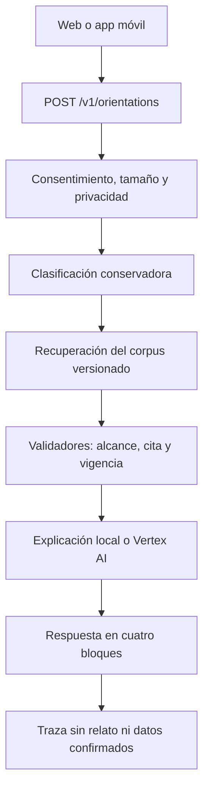

# Cómo funcionará el backend de HablaPE

## Contrato de respuesta

Cada orientación conserva cuatro bloques independientes:

1. **Hechos del usuario:** relato y campos que la persona confirmó.
2. **Fuente oficial:** chunks que existen en la versión activa del corpus.
3. **Explicación:** texto simple generado únicamente a partir de esas reglas.
4. **Acción y canal:** pasos determinados por código, no por el modelo.

La API devuelve además identificador de petición, flags, urgencia, resultados de
validadores, versión del corpus y advertencias de privacidad.

## Flujo

El modelo no puede cambiar una cita, plazo, autoridad o canal. Si Vertex falla,
la API conserva las reglas verificadas y degrada solo la explicación.

## Estado actual

| Capacidad | Estado |
| --- | --- |
| Orientación por texto | Implementada |
| Clasificación de los 12 escenarios sintéticos | Implementada y probada |
| Recuperación y citas desde el corpus | Implementada |
| Alertas de urgencia | Implementadas como alertas conservadoras |
| Borrador de reclamo con confirmación | Implementado |
| Detección de posibles DNI, correo y teléfono | Implementada |
| Trazas sin contenido del usuario | Memoria local; adaptador Firestore listo |
| Explicación con Vertex endpoint | Adaptador listo; falta endpoint y ADC |
| Voz | Pendiente de proyecto, región y prueba de locale |
| Actas y boletas reales | Pendiente de bucket, borrado y endpoint multimodal |
| Autenticación del frontend | Pendiente de definir backend privado o API pública protegida |

## Despliegue inicial

La primera revisión de Cloud Run utilizará:

- modo determinista;
- corpus incluido y versionado en la imagen;
- sin almacenamiento de relatos;
- backend privado por defecto;
- una cuenta de servicio administrada por GCP;
- 0 instancias mínimas y un máximo inicial de 5.

Después de comprobar latencia, contratos y acceso se habilitan Firestore,
Vertex AI, Speech-to-Text y cargas temporales, uno por uno.

## Decisiones que debe tomar el propietario

1. Proyecto GCP con facturación.
2. Región y restricciones de residencia de datos.
3. Backend privado o público protegido.
4. Si la primera IA será Gemma en endpoint dedicado o una API administrada.
5. Retención de audio/imágenes; recomendación inicial: borrado inmediato tras
   extracción y nunca usar archivos reales en evaluaciones.

Las instrucciones operativas están en `infra/gcp/README.md`.

